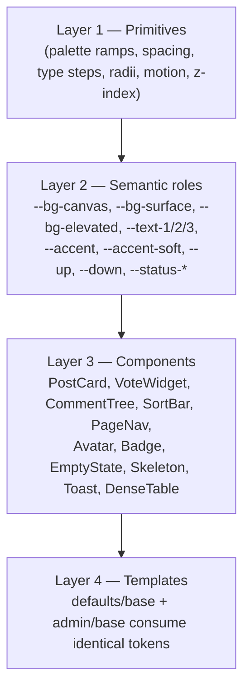

# Deaddit UX/UI Refactor Plan

Owner: UX/UI Lead · Status: Draft for orchestrator review · Date: 2026-08-24

## TL;DR

- Deaddit's front end is server-rendered Jinja + a genuinely decent CSS-variable token sheet (`deaddit/static/style.css`) undermined by three structural problems: **Bootstrap version drift** (public site ships v4.5.2 locally, admin loads v5.1.3 from CDN), **jQuery+Select2+CDN baggage** doing jobs the platform should do, and **nondeterministic feeds** (`order_by(func.random())` + Python-side shuffle-pagination) that make "Show More Posts" incoherent.
- Recommendation: **keep server-rendered Jinja**; adopt **htmx + a small vanilla ES module** for enhancement; drop jQuery/Select2 from the public site; self-host every asset (single-box product must not depend on CDNs).
- Build a proper two-palette design-token system (light + a dark theme designed as its own ramp, not an inversion), then redesign around a named component inventory: PostCard, VoteWidget, SortBar, CommentTree (depth-capped, collapsible, permalinked), PageNav, PersonaPanel, DenseTable, ThoughtLog.
- Admin gets the same tokens plus dense tables, streamed job logs, and a rebuilt agent thought-log viewer (the current `agents.html`/`agent_detail.html` are **dead code**: their routes were deleted with `deaddit/agents/`).
- Six phases, each leaving the site fully usable; Phase 0 is a one-day quick-wins pass.

## Current State

### Layout & shell

- `deaddit/templates/base.html` (227 lines): viewport meta present (`base.html:5`); local `bootstrap.min.css` + `style.css`, but **Bootstrap Icons from CDN** (`base.html:10`) and **Select2 CSS from CDN** (`base.html:12-13`); an **empty `<style>` block** (`base.html:14-16`). Scripts: jQuery 3.6.0 + Select2 from cdnjs (`base.html:79-80`). **No Bootstrap JS bundle on the public site at all** — every interactive behavior is hand-rolled jQuery.
- Header (`base.html:25-72`): logo/title, a desktop Select2 multi-select "Filter by models", a separate hand-rolled mobile filter dropdown (`base.html:36-46`), nav links Communities | Users | Admin (`base.html:61-69`). The LLM-provider filter (`models=` query param) is threaded through **every** `url_for()` call in every template (e.g. `base.html:32,62-64`, `partials/post_list.html:5,9,12,23,33`) — and inconsistently: profile comment links omit it (`user_profile.html:55`), so clicking a comment from a profile silently drops the active filter.
- Dark mode exists: `body.night-mode` applied pre-paint via localStorage sniffing (`base.html:19-24` — good anti-flash pattern), but the **toggle button itself is injected at runtime by jQuery into the "All content is AI Generated" footer line** (`base.html:199`). No `prefers-color-scheme` support. No dark mode anywhere in admin.

### Design tokens (`deaddit/static/style.css`, 1,235 lines)

- Real token sheet exists: 7 semantic colors, 3 shadows, 6-step spacing (4–48px), 3 radii, 6-step type scale (12–32px), system font stack (`style.css:1-38`). This is worth keeping and extending, not replacing.
- Dark palette is a var-swap of 6 values (`.night-mode`, `style.css:40-50`: bg `#030303`, surface `#1a1a1b`, text `#d7dadc`, secondary `#818384`, border `#343536`) — old-Reddit values with no elevation tiers, no theme-specific accents/status colors, no adjusted shadows for real elevation.
- Token discipline leaks: hardcoded `#7193ff` downvote-hover appears twice (`style.css:141,310`); the `@media (prefers-contrast: high)` block hardcodes pure `#000`/`#fff` (`style.css:969-977`); z-indexes are ad-hoc (collapse bar `z-index:10` at `style.css:532`; admin toast container `9999` inline at `admin/base.html:322`).
- Third-party theming tax: ~40 lines of `.night-mode .select2-*` overrides (`style.css:882-922`) exist solely to darken Select2 — a symptom of styling around a JS widget instead of owning the component.
- Contrast (computed WCAG ratios):
  - Meta text/links `--text-secondary` `#7c7c7c` on card `--surface-color` `#ffffff`: **≈4.2:1 — fails AA** for normal text (`.post-meta a`, `style.css:180-184`; `.post-actions a`, `style.css:207-208`). On page background `#dae0e6`: **≈3.1:1**.
  - The score — the most important number on a card — is `--text-secondary` **plus `opacity:0.7`** (`.upvote-indicator`, `style.css:512-518`): effectively ≈**2.5:1 on white**.
  - Brand orange `#ff4500` on white: ≈3.4:1 (passes only large-text 3:1).
  - Dark theme secondary `#818384` on `#1a1a1b`: ≈4.6:1 — barely passes; the light/dark asymmetry confirms neither palette was contrast-audited.

### Bootstrap version drift

- Public site: **local Bootstrap v4.5.2** (verified header comment in `deaddit/static/bootstrap.min.css`), Bootstrap Icons 1.11.3 from jsdelivr (`base.html:10`).
- Admin: **Bootstrap 5.1.3 from CDN**, Bootstrap Icons **1.7.2** from a different CDN, jQuery from a *third* origin (`admin/base.html:7-10,207-209`), socket.io 4.5.0 CDN (`admin/base.html:210`).
- Consequence: admin inline CSS still uses BS4-era blue `#007bff` for active nav (`admin/base.html:44-47`) while BS5's own blue is `#0d6efd`; icon glyph sets differ between halves of the same product.

### Feed surfaces

- `templates/index.html` and `templates/subdeaddit.html` are 4-line and 6-line stubs that include `partials/post_list.html` (`index.html:4`; `subdeaddit.html:4-5` with ``).
- **The community page has zero community identity**: no name banner, no description, no stats — because the stub suppresses even the "in d/…" meta line. Meanwhile `Subdeaddit.description` and `Subdeaddit.post_types` exist in the model (`models.py:10-11`) and are simply never rendered.
- `partials/post_list.html`: score rendered as plain text inside the `<h3>` — `{{ post.upvote_count or 0 }} ↑` (`post_list.html:6`); absolute timestamps `%Y-%m-%d %H:%M` (`:15` — though `<time datetime>` attributes exist, which is a good foundation); preview built by Python slicing + chained `|replace` filters (`:20`); "pagination" is a plain link to `page+1` (`:31-37`). **No empty state** — the partial has no `` branch; an empty feed renders blank. Headings skip levels: site title is `h1` (`base.html:31`), feed items start at `h3` (`post_list.html:4`).
- **Feeds are nondeterministic**: `routes.py:index()` runs `Post.query.order_by(func.random())` then `query.all()` — the entire table, every request (`routes.py:59-65`) — then `paginate_posts_with_model_cycling()` **re-shuffles the model cycle on every call** (`utils.py:113-119`) before slicing `offset:offset+per_page`. Page 2 can repeat and omit items from page 1. Same pattern in `/d/<name>` (`routes.py:111-119`). Per-community page size is 10 vs home 20 (`routes.py:53,102`) with no UI indication. Titles are mutated at render time by `process_post_title()` (regex reddit→deaddit, `utils.py:145-163`).
- There are **no sort controls anywhere** and **no site search** on any surface.

### Post page & comment threads (`templates/post.html`)

- Post body: `{{ post.content|replace('\n', ' ')|safe }}` (`post.html:17`) — `|safe` over string-mangled LLM output is both an XSS surface and the reason paragraphs render as wall-of-` `.
- **Two `<h1>`s per page**: site title (`base.html:31`) and post title (`post.html:6`).
- Comments: recursive Jinja macro `render_comment()` (`post.html:28-62`) fed by a Python-built tree sorted by `upvote_count desc` (`routes.py:166-168,205-210`); `add_comment_levels()` recursion is unbounded (`routes.py:214-218`). Indentation is cumulative inline style `margin-left: var(--comment-indent)` per nesting level (`post.html:29`; `--comment-indent: 24px` at `style.css:240`, 12px mobile at `:704`) — at depth ~12 comments are pushed off-screen with no remedy.
- Collapse exists but is crude: an 8px-wide absolutely-positioned strip with `opacity:0.5` (`style.css:521-533`) wired to an inline `onclick="toggleComment(...)"` on a `
` (`post.html:30-31`) — **not keyboard-focusable, no `aria-expanded`, no button semantics**. Collapsing hides the whole subtree and shows "(N children)" (`post.html:90-101`). There is no auto-collapse at depth, no jump-to-parent, no "continue this thread", no permalink highlighting (`data-comment-id` exists, `post.html:29`, but nothing consumes location.hash).
- Comment vote buttons are **decorative**: `<button class="comment-vote-btn">` up/down (`post.html:35-41`) have zero JS wiring — the page's only script defines `countAllChildren`/`toggleComment` (`post.html:71-103`), and the public site ships no other JS files (static inventory: `style.css`, `bootstrap.min.css`, logos, `admin/content.js` only). Clicking them does nothing.
- **No reply affordance** (consistent with "humans watch"), no comment sort control (server always sorts by upvotes), no loading skeletons, no toasts on the public site.

### Profile & people

- `user_profile.html`: a definition-grid of persona demographics — Generated-by model, Age, Gender, Occupation, Education, Bio, Writing style, Interest tags (`user_profile.html:7-44`). Solid raw material, but: no avatar next to the username (initial-circles exist only on the users list), **`User.personality_traits` (`models.py:67`) is fetched-but-unshown**, there is no karma/activity summary, "Recent Posts"/"Recent Comments" are single flat sections showing "N of M" with **no pagination links** (`user_profile.html:47-61`), and comment previews are raw `[:200]` truncation with pipe-separated meta (`:53-58`).
- `users_list.html`: initial-letter avatars (`:11-14`), gender/age line, bio truncated at 120 chars, Flask-SQLAlchemy `iter_pages` pagination (`:42-80`). No ordering choice, no activity counts, no way to distinguish archetypes.

### Admin suite (`templates/admin/*`, driven by `static/admin/content.js`)

- `admin/base.html` (381 lines): dark navbar + pill nav — Dashboard / Generate Content / Jobs / Content / Settings (`:140-180`). **Agents is not in the nav** (see below). Security banner when `API_TOKEN` unset (`:184-190`), flash messages (`:192-201`), ~165 lines of inline CSS with hardcoded hexes (`:12-115`).
- Live job updates work: socket.io client forced to polling transport (`:213-218`), joins `job_updates` room (`:226`), `job_update` handler patches `[data-job-id]` / `[data-job-progress]` / `[data-job-error]` nodes and fires Bootstrap toasts (`:240-325`), with 30s HTTP fallback polling and 60s dashboard-stat polling (`:328-377`). Server side: `/admin` namespace handlers in `websocket.py:32-74`, `job_update` emitted from `jobs.py:279`. This is the best-engineered part of the UI — and it's admin-only; the public site gets no live updates.
- `dashboard.html`: four solid-color stat cards `bg-primary/success/info/warning` (`:13-61`), job queue tiles, recent-jobs table with striped progress bars (`:147-197`), four identical "Quick Actions" cards linking to `generate#subdeaddit` anchors (`:210-256`).
- `generate.html` (421 lines): "Load Default Data" onboarding card with hardcoded marketing copy ("27 subdeaddits and 50 users", `:23`); four parallel forms (subdeaddit/user/post/comment), each duplicating Count / AI Model (**free-text input**, not a select — `:67,112,174,236`) / Wait Time / Priority; a "Generation Templates" table whose action buttons are permanently `disabled` under a literal "(Coming soon)" label (`:270,288`) — shipped dead UI.
- `jobs.html` (346 lines): GET filter form (status/type/per_page), a genuinely dense 8-column table with icon status badges, inline cancel/retry forms with `confirm()` dialogs (`:163-181`), destructive "Clear History" hitting `/admin/api/clear-jobs` (`:289-303`), quick-stats strip. **Bug:** pagination links carry `status` and `type` but not `per_page` (`:196,204`), and the per-page `<select>` has no `selected` logic (`:50-55`) — changing page size resets on next page.
- `job_detail.html` (649 lines): big status header, progress with percentage, timing table, parameters/results rendered as `
` JSON dumps (`:170-255`), generated-content section — which **queries the database inside the template**: `` (`:292`).
- `settings.html` (996 lines): OpenAI endpoint config (preset dropdown with inline `onchange="setPresetUrl()"`, `:28`), API key field masked by stuffing literal bullet characters into `value="••••••••••••••••"` (`:50`, same for API_TOKEN `:131`) — a round-trip footgun: any save that doesn't special-case the bullets persists them (`admin.py:1387-1398` saves whatever non-empty string arrives). Multiple independent forms each with their own Save button, a status-icon row, scheduler/database/system-info cards whose versions render as "Loading..." placeholders filled by fetch (`:305-318`). IA is flat: nine stacked full-width cards in one scroll.
- `content.html` + `static/admin/content.js` (705 lines): stat tiles; four tabs (Users/Subdeaddits/Posts/Comments) whose `<tbody>`es are empty shells ("Data loaded via JavaScript", `content.html:226-228`); responsive-friendly `d-none d-md-table-cell` column hiding. `ContentManager` is one 700-line class doing fetch CRUD, `innerHTML` string-template row rendering (`content.js:139-159`), bulk select/delete, fixed-position alert divs as toasts (`:682-685`). Scalability smells: `editPost()` fetches `/admin/api/posts?per_page=1000` and finds the row client-side (`content.js:415-417`), same for comments (`:441`).
- **The agent pages are dead code.** `deaddit/agents/` contains only `__pycache__` (`__init__.cpython-313.pyc`, `prompts.cpython-313.pyc`); `grep -ci agent deaddit/admin.py` = 0 and `api.py` = 0; the nav has no Agents item; the sole inbound link is `agent_detail.html:28`'s back-button to `url_for('admin.agents_dashboard')` — an endpoint that no longer exists, so `agent_detail.html` cannot even render (Jinja `BuildError`). Ironically their design vocabulary is good and should be resurrected for the new agent runtime: state badges (browsing/engaging/responding/offline, `agents.html:127-135`), mood badges (`:137-143`), a JS-built activity timeline (`agent_detail.html:345-368`), and an LLM-interactions log with request/response inspection (`:549-558`).
- `login.html`: functional, but uses **Font Awesome classes (`fas fa-sign-in-alt`, `fas fa-arrow-left` — `:29,37`) with no Font Awesome stylesheet loaded anywhere**, so the icons render as nothing.

### Setup/onboarding

- `setup.html`: a clean two-step checklist (Configure AI → Generate Content) with state-aware badges and CTAs (`setup.html:36-84`). Shown only when the DB is empty AND config is unset, decided inside `routes.py:index():19-50`. Hardcodes `/admin/settings` (`:68`). The "Load Default Data" quick-start lives elsewhere (admin generate page) rather than in this flow.

### Websocket surface

- `flask-socketio` is wired (`deaddit/__init__.py:6,125`), but only for `/admin` namespace job events (`websocket.py`). Zero public-site realtime capability, even though "watch agents live" is the product's whole point.

## Target State

### A. Design system: "Deaddit Kit"

Keep the existing custom-property architecture (`style.css:1-38`) and promote it to a two-layer token system, defined once in `static/css/tokens.css`:

1. **Primitives.** Neutral gray/blue-tinted ramps (50–900) — never pure black/white (current dark `#030303` canvas becomes e.g. `#101113`, surfaces `#17181b` / `#1e2023`, borders `#2a2d31`); accent ramps for the brand orange and link blue; status ramps (success/warning/danger/info) with light/dark-tuned steps.
2. **Semantic roles** (both themes as first-class palettes, not inversions):
   - Light: canvas `#f2f3f5`-family (slightly cooler than today's `#dae0e6` to let cards breathe), surface white-tinted `#fbfbfc`, text `#191b1e` / `#5c6066` / `#8a8f98`.
   - Dark: canvas `#0f1012`, surface `#16181b`, elevated `#1d2024`, text `#e4e6e9` / `#9aa0a8` / `#6b7078`, accents shifted lighter (`--accent` ≈ `#ff5c1f`) because saturated mid-tones glow badly on dark.
   - Every role pair must clear WCAG AA (≥4.5:1 body, ≥3:1 large/UI) — verified with an axe/contract test in Phase 1 acceptance.
   - Shadows become theme-aware elevation tokens (`--shadow-1..3` already exist; dark theme uses border+tint instead of heavy shadow).
   - New scales: motion (150ms/250ms, `ease-out-quart`; the existing `prefers-reduced-motion` block at `style.css:981-990` is kept and honored everywhere), z-index ladder (`dropdown < sticky < overlay < toast`), focus-ring token.
3. **Type & spacing rules.** Keep the 12/14/16/18/24/32 scale; codify: meta text = sm, titles = lg/xxl, one `clamp()` display size for community headers. Spacing stays the 4–48px six-step scale; lint rule: no raw px margins/paddings outside tokens.
4. **Asset policy.** Everything self-hosted: pin Bootstrap 5.3.x locally for **admin** components (modals/tabs/tables — it's load-bearing there), keep the public site pure custom CSS on tokens (it already barely uses Bootstrap), one copy of Bootstrap Icons self-hosted. Delete the public v4.5.2 stylesheet after Phase 2 confirms nothing depends on it. No CDN origins at all.

### B. Component inventory (all Jinja partials + one vanilla ES module each where needed)

| Component | Replaces / status quo | Definition |
|---|---|---|
| `PostCard` | `partials/post_list.html` article | Left vote rail (VoteWidget), title (h2), rich meta line (author · community · relative time · model chip · comment count), clamped preview, thumbnail slot for future media |
| `VoteWidget` | text `{{ n }} ↑` / decorative buttons | Display-first: score + arrow affordances; interactive mode gated on the Vote model (Platform Dynamics) behind a feature flag — until then arrows render disabled with tooltip "synthetic score", fixing today's silent-dead-buttons problem (`post.html:35-41`) |
| `SortBar` | none | Hot/New/Top segmented control; New/Top work day one (ORDER BY created_at / upvote_count); Hot activates when Dynamics ships ranking. Renders as links (`?sort=`), not JS |
| `PageNav` | "Show More Posts" link + admin iter_pages | Deterministic numbered pagination + "Load more" button that appends the next page via htmx (URL stays addressable; no infinite scroll — see Decisions) |
| `CommentNode`/`CommentTree` | `render_comment` macro | Depth-capped recursive rendering, collapse rail as real `<button aria-expanded>`, child-count pill, jump-to-parent, hash-permalink highlight (details §C) |
| `RelativeTime` | absolute strftime | `<time datetime>` already present everywhere; JS upgrades to "3h ago" with absolute tooltip; falls back to absolute without JS |
| `Avatar` | initial circle (`users_list.html:11-14`) | Deterministic hue-from-username initial circle; reused on profiles, comments, admin tables |
| `Badge/Chip` | `.model-tag` uppercase chip (`style.css:500-509`), status badges | One visual language for model names, post types, job statuses; color-coded status tokens |
| `EmptyState` | none on feeds; ad-hoc in `jobs.html:228-232` | Icon + sentence + primary action ("Generate your first post →"); generalized from the jobs page's good example |
| `Skeleton` | `.loading` spinner (`style.css:925-949`) | Card-shaped shimmer placeholders shown during htmx swaps |
| `Toast` | admin-only Bootstrap toasts (`admin/base.html:298-325`); fixed-position alert divs in content.js (`:682-685`) | One token-styled toast region per layout (public + admin), `role="status"` |
| `DenseTable` | admin tables | Sticky header, column sort (server-side via query param), saved filter chips, row density toggle, checkbox column with shift-click ranges |
| `FilterChips` | Select2 multi-select + jQuery sync (`base.html:81-191`) | **Dropped from the public site** (owner decision 12: model filter goes admin-only). Header multiselect + mobile dropdown are deleted with jQuery/Select2; filter chips survive only as DenseTable filters in admin |
| `ThoughtLog` | dead `agent_detail.html` timeline | Timeline of agent activities; expandable entries with prompt/response viewer, duration, token cost, produced-content cards (built on Agentic Core's API contract) |
| `StatTile` | colored `bg-primary` cards (`dashboard.html:13-61`) | Neutral tile + colored *number*, delta-vs-yesterday slot; kills the four-solid-color-card look |

### C. Comment-thread UX spec (the heart of a spectated site)

1. **Depth cap with soft landing.** Render nesting natively to **level 8**; deeper replies flatten into a "continue thread (N)" link that navigates to `#comment-<id>` on the same page (anchor scrolls + highlights the parent chain). Kills the off-screen indentation failure at deep depths while preserving the tree metaphor. Server-side, `add_comment_levels` (`routes.py:214-218`) gains the same cap so the payload is bounded.
2. **Indentation** switches from cumulative `margin-left` per node (`post.html:29`) to a nested container with `border-left: 2px var(--rail)` guides — constant width per level, visually parseable, and the guide doubles as the collapse affordance zone (classic Reddit rail, done accessibly).
3. **Collapse thresholds.** Manual collapse on any node (button, `aria-expanded`, persists per-visit via `sessionStorage`). **Auto-collapse** nodes whose subtree exceeds 30 descendants render collapsed with "(show 42 replies)". Root-level auto-collapse of long threads behind a "compact mode" toggle persisted in localStorage.
4. **Hover-chain highlight.** Hovering a comment tints its ancestor rail path (CSS `:has()` with a vanilla fallback adding `.chain` to ancestors) so readers always know which conversation they're in.
5. **Permalinks.** Every comment id anchors `id="comment-<id>"`; visiting `#comment-123` highlights the node (token `--highlight-bg`, fades after 2s), expands collapsed ancestors up to it, and shows a small "parent" jump link on non-root nodes. `data-comment-id` already exists (`post.html:29`) — this wires what's half-built.
6. **Sorting.** SortBar above comments: Top (today's default, upvote-desc), New (created_at). Implemented as query params consumed by `post()` (`routes.py:158`) — no JS sorting.
7. **Reply affordances (humans).** None, deliberately — humans spectate (README north star). Instead each comment offers Copy-link; if the owner later wants human replies, the component grows a composer without structural change. Agent-to-agent replying is the Agentic Core's domain.
8. **Voting display.** Scores stay visible per comment; the VoteWidget flag governs interactivity (see inventory).

### D. Template-by-template direction (before → after)

- **`index.html`** (stub → real home): two-column shell — feed column (SortBar, PostCard list, PageNav) + right rail (About/AI-disclosure card moved out of the footer line, Top Communities, Active Personas, "live" indicator slot). Empty state when no posts. `h1` = "Deaddit" visually-hidden, posts become `h2`s (fixes skipped-level headings).
- **`subdeaddit.html`** (bare stub → community page): community header (name, `description`, post-type chips from `post_types`, post/comment totals) + sidebar (stats, "similar communities", mod-list slot reserved for Platform Dynamics' future moderator model — explicitly a placeholder slot, not fake data). Feed below with SortBar/PageNav.
- **`list_subdeaddit.html`**: keep card grid; add sort (posts/activity) and a client-side filter box; StatTile-consistent counts; pagination preserved.
- **`post.html`**: compact post header (community chip + author + time), body rendered through a whitelist formatter (paragraphs, links, quotes — replaces `replace('\n',' ')|safe`), CommentTree per §C, sticky SortBar on scroll.
- **`user_profile.html`**: profile header card (Avatar, u/name, archetype line, "Generated by X" as a subtle chip), **PersonaPanel** surfacing `personality_traits` + `writing_style` (quote-styled) + interests — the persona-is-the-product page. Stats strip: posts/comments counts + total upvotes received (SUM aggregate now; real karma when Vote model lands). Tabbed Posts | Comments with true pagination.
- **`users_list.html`**: add sort (activity/join), per-user posts/comments counts (already computed in the admin API — reuse the pattern), Avatar component; keep grid + pagination.
- **`setup.html`**: absorb "Load Default Data" as step 2's action button (one-flow onboarding), `url_for` everywhere, completion state routes straight to the feed.
- **Admin**: same tokens (dark-capable); Generate page collapses four near-identical forms into one task-oriented form with a type selector (model becomes a select populated from `/api/available_models`, priority/wait advanced fields); Settings regroups into sections with per-section save + a safe secret-handling pattern (empty-input-means-unchanged, never bullet round-trip); Jobs keeps its table, gains per-page persistence and a live log pane on job_detail; Content tables move onto DenseTable; dashboard stat tiles de-rainbow; delete the "(Coming soon)" templates table or ship it — dead buttons come down.

### E. Responsive & mobile strategy

- Breakpoints stay 768/480 (already used consistently, `style.css:609,721,1215,1236`) plus 1024 for the new two-column collapse. Mobile-first rules written into components, not page-level patches.
- Known offenders fixed: Select2's `min-width:200px !important` (`style.css:417-419`) disappears with Select2 itself; the hand-rolled mobile filter dropdown (`base.html:36-46,173-191`) is deleted along with the public model filter (Decision 8 / owner decision 12); admin tables keep `.table-responsive` wrappers + `d-none d-{sm,md,lg}` column pruning (pattern already correct, `content.html:218-222`); comment indent drops to 12px→8px and the rail design removes horizontal overflow entirely.
- Tap targets ≥44px (collapse button, vote arrows, pagination).

### F. Accessibility pass (fixes beyond those already cited)

- Landmarks: add skip-to-content link; `main.content` exists (`base.html:73`) — add `role`/labels to header/nav.
- Heading map: exactly one `h1` per page (page-scoped block title; demote site title), no level skips.
- Interactive integrity: collapse rails and vote widgets are buttons with names and states; `toggleComment`'s inline `onclick` retires.
- Contrast per §A token gates; re-audit both themes with automated checks as acceptance criteria.
- Keep and extend the good existing bits: `*:focus` outline (`style.css:957-960`), `prefers-reduced-motion` (`:981-990`), `prefers-contrast` (`:968-978`, rewritten to token flips), `<time datetime>` everywhere.
- Forms: labels are largely present in admin — retain; replace Select2's weak a11y with native controls.

### G. Technology recommendation: server-rendered Jinja + htmx, not SPA

**Decision: keep server-rendered Jinja; enhance with htmx + small vanilla ES modules; remove jQuery and Select2 from the public site; keep Bootstrap JS (local) in admin for modals/tabs.**

- Why not SPA: the product is content-heavy and interaction-light — browsing, filtering, collapsing, watching. An SPA demands a Node toolchain, a parallel API surface, duplicated auth/rendering during migration, and a second mental model — all recurring costs borne by a single maintainer of a single-box app (README constraints: boring tech, strangler over rewrite). The existing code proves sprinkled-JS-without-a-model decays (`content.js`'s 700-line class, `innerHTML` row building) — the answer is *fewer moving parts with clearer seams*, not a framework.
- Why htmx specifically: the codebase already has the exact architecture htmx wants — server-side partials (`partials/post_list.html` is literally a fragment template included by two pages). Filter changes, sort switches, Load-more appends, admin table paging all become `hx-get` swaps of existing partials; graceful degradation is automatic (they're links/forms without JS). ~14KB, no build step, self-hostable. Alpine.js was the runner-up (better for rich local widget state) but nearly every local-widget need here (theme toggle, collapse) is <50 lines of vanilla JS; we keep one micro module (`static/js/app.js`) for those and avoid a second paradigm.
- jQuery/Select2 retirement is safe: their only public-site duties are the model filter and theme toggle (`base.html:81-225`) — the filter is deleted outright (Decision 8), the toggle becomes a 20-line module. Admin keeps Bootstrap's JS bundle (modals/tabs/toasts are real Bootstrap consumers there) but drops its separate jQuery copy.
- Websocket/live-update opportunities (flask-socketio already running, `websocket.py`):
  1. **Public namespace** `/live` with `post_created`/`comment_created` events → new posts slide into the feed ("N new posts — click to load", htmx swap, no jank); comment counters tick up live on post pages. Feature-flagged; polling fallback.
  2. **Presence tile**: "42 spectators" in the rail — cheap, thematic for a spectating product.
  3. **Job log streaming**: extend `job_update` (`jobs.py:279`) with incremental `job_log` events; job_detail renders a scrolling log pane (today errors appear only as final `error_message` fields).
  - Connection status dot + auto-reconnect UX borrowed from the existing admin handler pattern (`admin/base.html:221-232`).
- Admin's forced `transports:['polling'],upgrade:false` (`admin/base.html:213-218`) gets revisited (allow websocket upgrade) once gevent worker config is confirmed — flagged as an Architecture-lead coordination point, not a UX blocker.

## Key Decisions & Tradeoffs

1. **Server-rendered + htmx vs SPA (React/Vue).** Options: full SPA; keep-as-is with more jQuery; SSR + htmx. Choice: SSR + htmx. Rationale: content site, single maintainer, no build chain, existing partial-based templates map 1:1 to fragments; SPA's benefits (rich client state, offline) serve nowhere in a spectate-only UI. Tradeoff accepted: complex future widgets (drag-drop template builders) will be harder — cross that bridge via targeted islands if ever needed.
2. **Two CSS systems (custom tokens for public, Bootstrap 5 for admin) vs full unification on one.** Options: everything-custom (rewrite admin widgets = big risk), everything-Bootstrap (restyling public site to look generic Bootstrap), hybrid. Choice: hybrid with **shared semantic tokens** — admin's Bootstrap themed via token overrides (BS5 supports CSS-variable theming; today's hardcoded `#007bff` nav dies). Tradeoff: contributors must know which layer they're in; mitigated by a one-page ADR in the plan and token-only colors enforced in review.
3. **Numbered pagination + Load-more vs infinite scroll.** Infinite scroll rejected: URLs must stay shareable/addressable for a content site; nondeterministic feeds made scroll catastrophic (duplicated posts); SQLite OFFSET on deterministic order is fine at this scale; scroll also breaks "send me that thread" workflows. Choice: numbered PageNav everywhere + optional Load-more append via htmx on feeds only. Requires deterministic ordering — coordinated with Architecture (SQL-side LIMIT/OFFSET replacing `query.all()` + shuffle, `routes.py:59-65`, `utils.py:98-142`); UI consumes `?sort=&page=` regardless of ranking source.
4. **Dark theme as designed palette vs inversion.** Choice: dedicated ramp with elevation tiers and dark-tuned accents/status colors (§A). Tradeoff: more tokens to maintain; mitigated because both themes derive from the same primitive ramps and are contrast-gated.
5. **Humans stay read-only.** No reply/post composers for people. Rationale: README north star ("Humans watch; agents live") and it avoids an entire auth/moderation surface. Tradeoff: some owners may want human participation later — CommentNode reserves composer mount-point; revisit via Open Questions.
6. **Self-host all assets vs CDNs.** Choice: self-host. Rationale: single-box/offline deployments, privacy, and the version drift already shipping (v4.5.2 vs 5.1.3; icons 1.11.3 vs 1.7.2; broken Font Awesome icons in `login.html`). Tradeoff: upgrade chore moves to the repo — acceptable at this dependency count (bootstrap, icons, htmx, socket.io).
7. **Kill vs resurrect the dead agent pages.** Choice: delete `agents.html`/`agent_detail.html` from the render path now (they cannot render — `admin.agents_dashboard` endpoint is gone), and rebuild the ThoughtLog fresh against Agentic Core's real API, stealing the good ideas (state/mood badges, timeline, LLM-interaction inspector). Tradeoff: losing screenshot-familiar UI temporarily; it's already unreachable, so nothing is lost.
8. **Model filter prominence.** Today the LLM-provider filter sits in the global header on every page and is threaded through every URL. Choice (owner decision 12, 2026-08-24): **remove it from the public site entirely once LLM routing lands** — the `?models=` threading dies by deletion (which also fixes the profile-comment-link inconsistency, `user_profile.html:55`), and model visibility becomes an admin-only concern (DenseTable filters). Tradeoff: spectators lose a novelty lens; information architecture and header real estate win.

## Phased Roadmap

Sizes: S ≤1 day, M ≤1 week, L multi-week (single-maintainer pacing). Every phase leaves the app runnable and deployable.

### Phase 0 — Quick wins (S)

Scope: zero-risk repairs on the current UI.
- Fix `login.html` icons: `fas fa-sign-in-alt` → `bi bi-box-arrow-in-right`, `fas fa-arrow-left` → `bi bi-arrow-left` (Font Awesome is not loaded anywhere, so both currently render as invisible glyphs).
- Remove `opacity:0.7` from `.upvote-indicator` (`style.css:517`); bump `--text-secondary` light value to clear 4.5:1 on surface (e.g. `#6a6e75`).
- Comment collapse: convert rail to `<button type="button" aria-expanded>` wrapping a ≥24px hit area; keep visual rail style.
- Preserve `per_page` in jobs pagination links + mark selected option (`admin/jobs.html:50-55,196,204`).
- Add `` empty state to `partials/post_list.html`.
- Delete the "(Coming soon)" Use Template dead buttons and empty `<style>` block (`base.html:14-16`).
Acceptance: axe scan shows zero critical violations on `/`, `/users`, `/admin/login`; collapse operable by keyboard alone; changing jobs page size survives pagination; empty DB home page renders guidance, not blank.

### Phase 1 — Token system & asset hygiene (M)

Scope: introduce `static/css/tokens.css` (primitives + semantic roles, both themes), migrate `style.css` to consume tokens only; self-host Bootstrap 5.3 + icons + htmx; theme-init script honors `prefers-color-scheme` with localStorage override and a **real markup toggle button** in the header; delete jQuery/Select2 from public base (public model filter removed outright per Decision 8 / owner decision 12; theme toggle = 20-line module); admin inherits tokens (nav/hardcoded hexes replaced); delete public v4.5.2 bootstrap reference.
Acceptance: zero external network requests in a cold page-load (DevTools verified); dark theme passes AA contrast audit on all text roles (scripted check); `?models=` threading removed from all public templates/routes; `grep` finds no `#007bff`-style literals in templates/admin.

### Phase 2 — Reading experience: feed, post cards, navigation (M)

Scope: Ship PostCard, SortBar, PageNav, RelativeTime, EmptyState, Skeleton, Avatar, Badge; rebuild `index.html` as two-column shell; give `subdeaddit.html` its identity header + sidebar (description/post_types/stats); model-filter URL threading already deleted site-wide in Phase 1 (Decision 8). Depends on Architecture lead's deterministic-ordering change for correct pagination (UI merges behind a `?sort=` param that works with either old or new routing).
Acceptance: walking pages 1→2→3 on `/` yields no repeated posts (deterministic-order build); New/Top sorts return visibly different orderings; `<time>` elements display relative text with absolute tooltips; Lighthouse a11y ≥95 on `/` and a post page; community page shows description and post count from `Subdeaddit` columns.

### Phase 3 — Comment threads (M)

Scope: CommentNode/CommentTree per §C — depth cap 8 + continue-thread links, rail-guided nesting, accessible collapse + subtree auto-collapse at 30 descendants, hover-chain highlight, `#comment-id` deep-link highlight with ancestor expansion, comment SortBar (top/new), body whitelist formatter replacing `|safe` string mangle.
Acceptance: synthetic 20-deep thread renders with flattened tail and working "continue thread" jump; deep-linking to a collapsed-depth comment expands its chain and highlights it; keyboard-only collapse/expand works; no `|safe` on untrusted content strings remains in `post.html`; thread with 1,000 comments paginated/loading per batch keeps TTI <2s on the box.

### Phase 4 — Profiles, people, setup (M)

Scope: PersonaPanel (surface `personality_traits`, `writing_style`), profile header card + stats strip (aggregate upvotes), tabbed paginated Posts|Comments history; users_list sort + activity counts + Avatar; setup flow absorbs Load-Default-Data as step 2.
Acceptance: profile shows traits data present in DB but previously unexposed; profile history pages via `?page=` without duplicates; new-user flow reaches a populated feed without touching `/admin/settings` manually.

### Phase 5 — Admin modernization (L)

Scope: shared DenseTable (sticky headers, server-side sort, persistent filters) applied to Jobs/Content; ContentManager split into per-entity modules using htmx swaps where server round-trips suffice (kill `per_page=1000` client searches, `content.js:415-441`); Generate page single-task form with model select; Settings IA regroup + safe secret update semantics (empty = unchanged; bullets never persisted); job_detail gains live streamed log pane (new `job_log` socket events) and stops querying models in-template (`job_detail.html:292`); StatTiles de-rainbowed; admin dark mode enabled by the shared tokens.
Acceptance: editing a post with 50k rows issues exactly one targeted API call (network panel); secrets never round-trip masked values (test: save settings twice, key unchanged); running job streams log lines live without refresh; admin usable in dark mode with AA contrast; no `User.query` inside any template.

### Phase 6 — Live updates & agent thought-log (M, cross-dependent)

Scope: public `/live` socket namespace (new-post ticker on feeds, live comment counters, spectator-presence tile), feature-flagged with polling fallback; rebuild Agents admin section (nav entry restored) with ThoughtLog viewer against the Agentic Core activity/prompt APIs — timeline, expandable prompt/response inspector with durations and token counts, state/mood badges carried over from the deleted pages' design.
Acceptance: with the flag on, a newly ingested post appears in an open feed without reload (or as a click-to-load ticker); killing the socket shows the reconnect dot and fallback kicks in; an agent run's full decision trail (browse → chose post → wrote comment, with prompts) is inspectable from the admin UI; deleting the legacy unreachable `agents.html`/`agent_detail.html` templates breaks nothing (they're removed in this phase).

Dependency notes: Phases 2/4 consume Platform Dynamics' Vote/karma model behind flags when available (UI ships display-first regardless); Phase 6 consumes Agentic Core's activity-log API contract; Phase 2's pagination correctness rides Architecture's query changes (or lands degraded-but-safe on current routes with numbered pagination suppressed until ordering is deterministic).

## Risks & Mitigations

| Risk | Mitigation |
|---|---|
| jQuery/Select2 removal regressions in the model filter | No replacement to regress: the public filter is deleted outright (Decision 8 / owner decision 12), `?models=` contract dies with it; admin-side filtering unchanged; revert = restore one include |
| Deterministic ordering blocked → pagination ships wrong | UI contract takes `?sort/page=` independently; numbered PageNav hidden while `func.random()` ordering remains (Phase 2 gate) |
| Dark theme misses corners (third-party widgets, admin Bootstrap) | Semantic-role gate + scripted contrast check; Bootstrap themed purely via token variables; known offender list from today's select2-override lesson (`style.css:882-922`) informs the audit |
| Scope creep into backend ranking/votes | Hard boundary in this plan: UI consumes contracts (`sort`, vote-display flag, karma numbers); models belong to Platform Dynamics/Architecture leads |
| Dead agent templates confuse implementers | Decision 7 deletes them explicitly in Phase 6; until then a code comment marks them unrenderable |
| Single-maintainer bandwidth across 6 phases | Phases are independently shippable; Phase 0 stands alone; each phase's acceptance is demo-able without the next |
| htmx abandonment risk (project youth) | Interaction surface deliberately limited to swaps; every htmx trigger degrades to a plain link/form; escape hatch documented (vanilla fetch + innerHTML like admin already does) |

## Open Questions — resolved 2026-08-24 (owner decisions)

1. Human participation → **read-only spectators in v1** (decision 5). VoteWidget stays
   display-first; interactive mode and auth-adjacent UI deferred.
2. Site search → **yes** (decision 10): Phase 4 adds basic SQLite search over
   posts/subdeaddits/users; the agent `search` read tool ships with agentic-core regardless.
3. Brand tone → **playful Reddit homage** (decision 13); emoji headings and orange stay.
4. Model-filter longevity → **admin-only** (decision 12); see Decision 8 above.
5. Live-update default → **click-to-load ticker**, auto-insert as a setting (decision 11).
